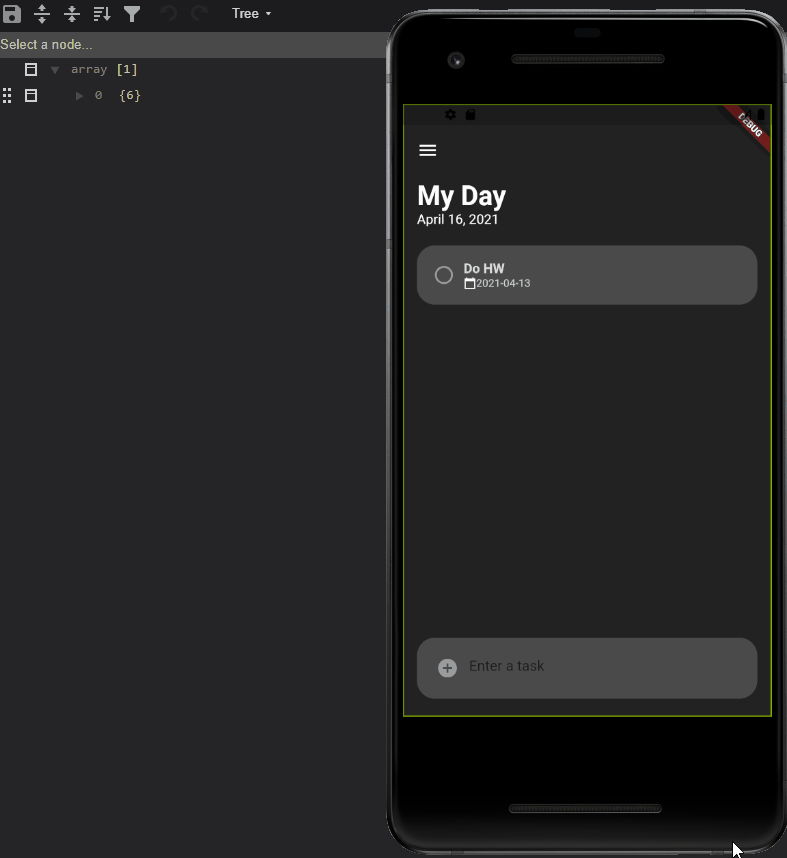

# app-whitTasks

Note: If running on your own computer, the server may not have been run in a couple of hours and will throw and error the first time the application is built because it did not have enough time to boot. Try rebuilding again and it will usually work. 

This is an app built for my Computer Science class, How to Build Darn Near Anything, and co-authored by Madeline Schiefelbein.

We decided to build this app because we feel that at Whitworth University, no app can help students easily see their day and upcoming assignments. We feel that our app, WhitTasks, is the solution. The current system, an optional Blackboard app, has a variety of challenges, such as lag when assignments are posted and a difficult to use UI. The Blackboard app is limited to only assignment postings as well. Our app provides students with the ability to add in their school schedule, as well as activities around campus that they are interested in attending, or meetings that they have to attend. Students can add these into a checklist feature of the app that would allow them to check off each of these “tasks” as they are completed.

At the moment we have the "My Day" page built and the Calender page built. The My Day page will be the first thing students see when they open their app. This will show any upcoming assignments that have been posted to Blackboard as well as any Tasks they have added themselves. The currently added Calender page displays tasks in a calender view. The user is able to click through differnt days and see all tasks for a given day. Eventually, we will have more pages built such as a campus activities page.

You can find more about our app and who we are here: https://whittasksdevnode.azurewebsites.net/

Here we have a current demo of our app.

This video demonstrates a couple of things with our app:
- The MyDay page 
- The newly added calender page showing tasks on a per day basis 
- The app talking to the API
    - Addition of tasks
    - Deletion of tasks 
    - Marking a task as completed

What needs to be done next:
- Currently every task is added as user 1. A login in page would solve this 
-  Dates are shown in yyyy-mm-dd format. A new format and way to edit task dates should be implemented
-  When tasks are added, it takes a second to add it because it must run an SQL procedure before it can be added. A solution is to create a local task and once the new task has been created by the SQL procedure, the local task will be overriden

