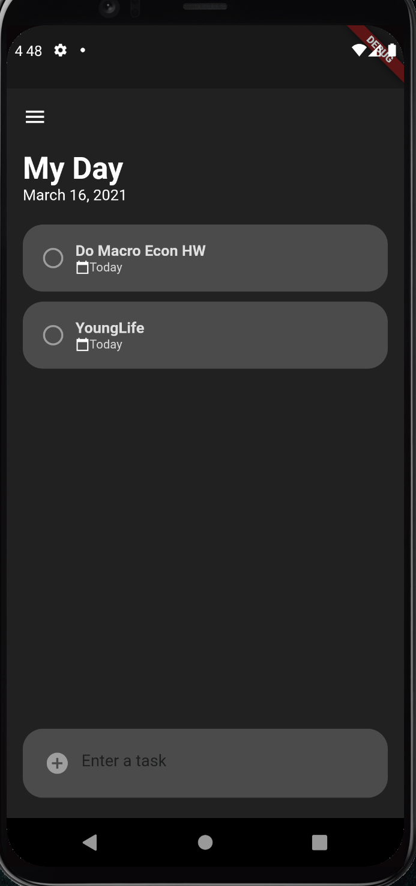

# app-whitTasks

This is an app built for my Computer Science class, How to Build Darn Near Anything and co-authored by Madeline Schiefelbein.

We decided to build this app because we feel that at Whitworth Univeristy, there is no app that can help students easily see their day and upcoming assingments. We feel that our app, WhitTasks, is the soultion. The current system, an optional Blackboard app, has a variety of challenges, such as lag when assignments are posted and a difficult to use UI. The Blackboard app is limited to only assignment postings as well. Our app provides students with the ability to add in their own school schedule, as well as activities around campus that they are interested in attending, or meetings that they have to attend. Students can add these into a checklist feature of the app that would allow them to check off each of these “tasks” as they are completed.

At the moment we have the "My Day" page built. This page will be the first thing students see when they open their app. This will show any upcoming assingments that have been posted to Blackboard as well as any Tasks they have added themselves. Eventually we will have more pages built such as a calandar page, and campus activies page.

You can find more about our app and who we are here: https://whittasksdevnode.azurewebsites.net/

Here we have a first demo of our app.

